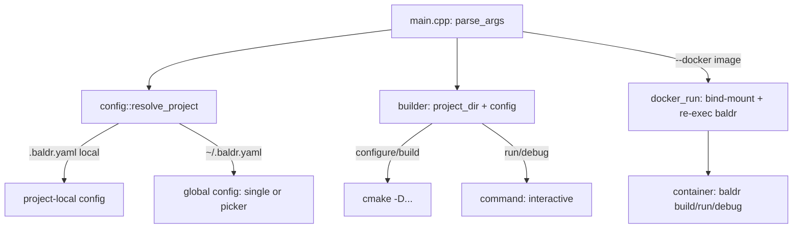

# Requirements

### Overview & Goals
Extend `baldr build`/`run` beyond the current bare-bones `builder` (`baldr/builder.cpp`) to close its existing TODOs and add the features requested next: build-type-aware CMake build directories, a `--delete` clean-build flag, `--` argument forwarding to the built target, `-D` CMake define forwarding, a YAML config file (`./.baldr.yaml` falling back to `~/.baldr.yaml`) describing per-project debugger/CMake-define settings and multiple named projects with an automatic interactive picker, a `--debug` flag to run the target under a configurable debugger, and a `--docker <image>` wrapper so build/run/debug can transparently re-execute inside a container via the already-cherry-picked `docker_run`.

### Scope
**In scope**
- `builder`'s existing TODOs: build-type subdirectories under `build/`, and recognizing when a re-configure is required.
- `--delete` flag to wipe the build directory before building (clean build).
- `--` argument forwarding: everything after `--` is passed to the built/run target's own argv.
- `-DKEY=VALUE` (repeatable) forwarded to `cmake -S . -B build -D...` at configure time; changing defines between runs must trigger a re-configure.
- `.baldr.yaml` config file: discovered in the current directory, else in `$HOME`; supplies default debugger, default CMake defines, and (optionally) a map of named projects.
- Multi-project support: when `-p` is omitted, no local `.baldr.yaml` exists, and `~/.baldr.yaml` defines more than one project, baldr automatically prompts the user (numbered list on stdin) to pick one instead of failing.
- `--debug`: runs the resolved target under a debugger (`gdb` by default) attached interactively, with the debugger executable/extra args overridable per-project in the config.
- `--docker <image>`: available on `build`/`run`/(`--debug`), re-executes the equivalent `baldr` invocation inside a fresh container via the existing `docker_client`/`docker_run`, so every feature above is usable unmodified inside a container.

**Out of scope**
- Changing the existing `baldr docker -i <image> <cmd...>` raw-command subcommand's behavior (it stays as-is; `--docker` is an additive flag on other commands).
- Any debugger UI beyond attaching interactively (no TUI/DAP integration).
- Persisting/caching CMake define state anywhere other than a marker file inside the build directory.

### User Stories
- As a `baldr` user, I want a `--delete` flag so I can force a clean rebuild without manually removing the `build/` directory.
- As a `baldr` user, I want to pass extra arguments to my program via `baldr run -t app -- --foo bar`.
- As a `baldr` user, I want to pass CMake defines via `-DCMAKE_BUILD_TYPE=Debug` and have baldr reconfigure automatically when they change.
- As a `baldr` user with several projects, I want a `.baldr.yaml` so I don't have to keep typing `-p`/debugger flags, and I want to be prompted to pick a project when it's ambiguous.
- As a `baldr` user, I want `--debug` to drop me straight into `gdb` (or my configured debugger) attached to my freshly built target.
- As a `baldr` user working in a container-based workflow, I want `--docker <image>` to run the exact same build/run/debug commands inside a container without changing how I invoke baldr.

### Functional Requirements
- `baldr build --delete` removes the project's build directory (CMake) or cleans (`make clean`-equivalent, i.e. just re-running from scratch) before building.
- Build output for CMake projects lives under `build/<build_type>/` (default build type `debug`); Makefile-based projects are unaffected (they already build directly into `project_dir`).
- `baldr run -t app -- --foo bar` forwards `--foo bar` to `app`'s own argv, unaffected by baldr's own option parsing.
- `baldr build -DFOO=1 -DBAR=2` passes both defines to `cmake -S . -B <dir> -D FOO=1 -D BAR=2`; a defines-changed reconfigure is detected by comparing against a cached list of defines used for the last configure (stored inside the build directory).
- `.baldr.yaml` (project-local) or `~/.baldr.yaml` (global, multi-project) is loaded if present; project-local values, when present, take precedence over the resolved global project's values, which in turn take precedence over hardcoded defaults.
- If `-p` is omitted, no project-local `.baldr.yaml` exists, and the global config defines exactly one project, that project is used implicitly; if it defines more than one, baldr lists them and reads a numeric choice from stdin.
- `baldr run --debug -t app` launches `gdb --args ./build/debug/app <forwarded args>` (or the configured debugger/args) interactively instead of running the target directly.
- `baldr build --docker myimage` / `baldr run --docker myimage -t app` / with `--debug` all execute the equivalent `baldr <command> ...` (rebuilt without `--docker`) inside a fresh container of `myimage` via `docker_run`, with the project directory bind-mounted (or copied — see Technical Design) so the container sees the same sources.

### Non-Functional Requirements
- No behavior change for existing invocations that don't use any of the new flags (backwards compatible defaults: build type `debug`, no config file present, no `-D`s).

# Technical Design

### Current Implementation
- `baldr/builder.hpp/.cpp`: `builder(project_dir)` with `build()`/`run(target)`; `discover_project_type()` picks `make` vs `cmake --build build`, auto-configuring once if `build/CMakeCache.txt` is missing. Two open TODOs: (1) build-type subdirectories, (2) recognizing when CMake needs re-configuring.
- `baldr/command.hpp`: `command` — pull-based `poll()`/`wait()`, RAII `pipe`, `interactive` mode (child inherits the parent's TTY, used today only by `builder::run`), `env` map override (used for `CC`/`CXX`).
- `baldr/docker.hpp/.cpp`: `docker_client` (Unix-socket HTTP client to the Docker Engine API) + free function `docker_run(image, cmd) -> int`, already wired into `main.cpp` as the `docker` subcommand (`baldr docker -i <image> <cmd...>`).
- `baldr/main.cpp`: `parse_args()` builds a `boost::program_options` positional-command CLI (`build`/`run`/`docker`) into an `options` struct; `entrypoint()` dispatches to `builder`/`docker_run`, converting `nova::exception` into an `nxs::rlog::failure` + rethrow (non-zero exit via `NOVA_MAIN`).
- `liblexy/descriptor.cpp` is the project's established YAML-loading pattern: `YAML::LoadFile`/`YAML::Load`, wrapped in `nova::expected<T, nova::error>` with `try/catch` around yaml-cpp's exceptions.
- `dependencies.cmake`/`conanfile.txt` already provide `yaml-cpp` project-wide; `baldr/CMakeLists.txt` does not yet link it (only `nxs`, `Boost::program_options`, `Boost::headers`, `nlohmann_json::nlohmann_json`).

### Key Decisions
- **Config lives in a new `baldr/config.hpp/.cpp`**, following `liblexy::descriptor`'s load-and-parse pattern but simpler: a single `nova::expected<config, nova::error> config::load(project_dir)` that tries `<project_dir>/.baldr.yaml` first, then `$HOME/.baldr.yaml`, returning a default-constructed `config` (all defaults, no projects) if neither exists — never a hard error for "file not found".
- **Single schema, two shapes**: a config file may either describe one implicit project directly at the top level (`dir`/`debugger`/`debugger_args`/`cmake_defines`) or a `projects:` map of named entries with the same fields; `config::resolve_project(explicit_dir_from_dash_p)` implements precedence (`-p` > project-local file > global single project > global picker) and only prompts (numbered stdin read) when the global file has 2+ `projects` entries, no `-p`, and no project-local file.
- **CMake defines change-detection via a marker file**: `builder` writes the resolved list of `-D` args (CLI `-D` merged over config `cmake_defines`, CLI wins on conflict) to `build/<type>/.baldr-defines` after a successful configure; `discover_project_type()` re-configures whenever that file is missing, its content differs from the currently resolved defines, or `--delete` was given — this directly resolves both existing TODOs without needing to shell out to `cmake -L`.
- **Build-type subdirectory**: `builder` gains a `build_type` field (`debug` by default; no new CLI flag introduced now — value comes from config `build_type` if present, else `"debug"`, keeping this change additive), changing `CMakeBuildDir` from the fixed `"build"` to `"build/" + build_type`; Makefile projects are untouched.
- **Argument forwarding**: `main.cpp`'s positional `args` option (already used for `docker`) is reused: everything after a literal `--` becomes `options.forwarded_args`, passed through to `builder::run`/`builder::debug` and appended after the target's own path in the final `command` argv (never fed to `boost::program_options` itself, since `--` already stops option parsing in Boost.ProgramOptions when passed through `command_line_parser`).
- **Debugger invocation**: `builder::debug(target)` mirrors `run()` but prepends the resolved debugger (`config.debugger`, default `"gdb"`) and `config.debugger_args` (default `{"--args"}`) ahead of the target path, still run via `command{ ..., interactive=true }` so the debugger owns the TTY exactly like a plain interactive run.
- **`--docker` as argv re-exec, not a fork-and-mount trick**: rather than teaching `docker_client` to bind-mount, `--docker <image>` builds the argv baldr would have run *without* `--docker` (reusing the already-parsed `options`), plus a fixed bind-mount of `project_dir` into `/workspace` inside the container (Docker Engine API `HostConfig.Binds`), and calls `docker_run(image, { "baldr", ...same-args-minus---docker..., "-p", "/workspace" })`; this requires `docker_client::create_container` to accept an optional bind-mount list (small, additive change) and the container image to already contain a `baldr` binary — documented as a precondition, not auto-installed by baldr.
- **Config location precedence recap**: `-p` (explicit project dir) always wins for *which directory to build*; the *config values* (debugger/defines/build type) still come from whichever `.baldr.yaml` resolves per the rule above, so `-p` and config-provided settings can be combined (e.g. `-p .` with debugger settings from `~/.baldr.yaml`'s matching project entry, matched by resolved absolute path).

### Data Models / Contracts
```yaml

# .baldr.yaml (project-local) or ~/.baldr.yaml (global) — single-project shorthand

debugger: gdb                 # optional, default "gdb"
debugger_args: [--args]       # optional
build_type: debug             # optional, default "debug"
cmake_defines:
  DCMAKE_BUILD_TYPE: Debug

# ~/.baldr.yaml — multi-project shape (mutually exclusive with the shorthand above)

projects:
  myapp:
    dir: ~/code/myapp
    debugger: lldb
    cmake_defines: { CMAKE_BUILD_TYPE: RelWithDebInfo }
  otherapp:
    dir: ~/code/otherapp
```
```cpp
namespace baldr {
struct config {
    std::string debugger = "gdb";
    std::vector<std::string> debugger_args = {"--args"};
    std::string build_type = "debug";
    std::map<std::string, std::string> cmake_defines;

    static nova::expected<config, nova::error> load(const std::string& project_dir);
    // resolves -p / project-local file / global single-or-picked project
    static nova::expected<std::pair<std::string, config>, nova::error>
        resolve_project(std::optional<std::string> explicit_dir);
};
}
```

### Components
- `baldr/config.hpp/.cpp` (new): YAML loading + project resolution/picker, per Key Decisions.
- `baldr/builder.hpp/.cpp` (modified): takes a `config` alongside `project_dir`; gains `build_type`-aware `CMakeBuildDir`, defines-marker-file reconfigure logic, `--delete` handling, forwarded-args support in `run()`, and a new `debug(target, forwarded_args)`.
- `baldr/command.hpp` (unmodified core; reused as-is for both `run` and `debug`).
- `baldr/docker.hpp/.cpp` (modified): `create_container` gains an optional bind-mount parameter; `docker_run` gains an overload/parameter for mounting a host directory at `/workspace`.
- `baldr/main.cpp` (modified): new `-D`/`--delete`/`--debug`/`--docker` options, `--` positional split into `forwarded_args`, config loading wired ahead of dispatch, picker prompt on stdin when needed.

### Architecture Diagram


### Risks
- Detecting "defines changed" via a marker file is simple but won't catch defines changed by editing `CMakeCache.txt` directly outside baldr; acceptable per the issue's own "or recognize automatically" wording (best-effort, not exhaustive).
- `--docker` assumes the target image already has a `baldr` binary and the same toolchain; this is called out as a precondition rather than solved by auto-provisioning, to keep the change additive and small.
- Interactive picker reading from stdin doesn't work non-interactively (e.g. CI); documented as a limitation — CI users are expected to pass `-p` explicitly.

Resolved: `baldr`'s own binary is bind-mounted into the container (config/CLI `baldr_binary_path`, default `~/.local/bin/baldr`) instead of assuming the image already contains it; additional host mounts, container networking mode, env var passthrough, uid/gid mapping, and keep-on-failure are all configurable — see the new Steps 8-9 below.

# Delivery Steps

### ✓ Step 1: Resolve builder TODOs: build-type directories and forced-reconfigure detection
`builder` writes CMake build output under `build/<build_type>/` and reliably re-configures only when actually needed.

- Add a `build_type` field to `builder` (default `"debug"`, no CLI flag yet — value is hardcoded for now, config wiring comes later) and change `CMakeBuildDir` from `"build"` to `fmt::format("build/{}", build_type)`.
- Introduce a `.baldr-defines` marker file written into the build directory after a successful `cmake` configure, initially just recording an empty defines list.
- Update `discover_project_type()` to reconfigure whenever the marker file is missing (covers the case of a partially-created build directory), replacing the current `CMakeCache.txt`-only check.
- Add a `--build-type <name>` CLI flag immediately (default `"debug"`), wired into `builder`'s `build_type` field from the start; the value is validated case-insensitively against the standard CMake build types (`Debug`, `Release`, `RelWithDebInfo`, `MinSizeRel`), canonical casing used for CMake, all-lowercase for the build directory name.
- Verify against the existing `baldr/tests/cmake-project` fixture that a first `baldr build` configures once, and a second run does not reconfigure.

### ✓ Step 2: Add `--clean` clean-build flag
`baldr build --clean` performs a clean rebuild (renamed from `--delete` per user request).

- Add a `clean_build` bool to `main.cpp`'s `options`/CLI (`--clean`), threaded into `builder::build()`; when set, `fs::remove_all` the resolved build directory (CMake) or, for Makefile projects, run `make clean` if a `clean` target exists, before proceeding.
- Update `print_help()` and manually verify `baldr build --clean` against `baldr/tests`.

### ✓ Step 3: Add `--` argument forwarding to `run`
`baldr run -t app -- <args>` forwards extra args to the target's own argv.

- Add a `forwarded_args` field to `options`, populated from everything following a literal `--` in argv (split out before handing the rest to `boost::program_options`, since `command_line_parser` already stops parsing at `--`).
- Update `builder::run(target, forwarded_args)` to append `forwarded_args` after the target's own path in the `command` argv.
- Update `print_help()` and manually verify `baldr run -t app -- --foo bar` against `baldr/tests`.

### * Step 4: Add `-D` CMake define forwarding with change-based reconfiguration
`baldr build -DFOO=1 -DBAR=2` passes defines to CMake and automatically reconfigures whenever the resolved define set changes between runs.

- Add a repeatable `-D`/`--define KEY=VALUE` CLI option (`po::value<std::vector<std::string>>()->multitoken()` or repeated `->composing()`) collected into `options.cmake_defines`.
- Extend `discover_project_type()`'s configure invocation to append `-D<key>=<value>` for each resolved define, and to write the exact resolved list into the `.baldr-defines` marker file after a successful configure.
- Change the reconfigure check to compare the current resolved defines against the marker file's contents (in addition to the missing-file case from Stage 1), reconfiguring on any mismatch.
- Verify manually: building once with `-DFOO=1`, then rebuilding with `-DFOO=2` triggers a fresh `cmake` configure while an unchanged rebuild does not.

###   Step 5: Add `.baldr.yaml`/`~/.baldr.yaml` single-project config loading
A project-local or home-directory YAML config supplies default debugger and CMake-define settings that CLI flags can still override.

- Link `yaml-cpp::yaml-cpp` into `baldr/CMakeLists.txt`.
- Add `baldr/config.hpp/.cpp` with a `config` struct (`debugger`, `debugger_args`, `build_type`, `cmake_defines`) and `config::load(project_dir)` returning `nova::expected<config, nova::error>`, following `liblexy::descriptor`'s `YAML::LoadFile` + try/catch pattern, checking `<project_dir>/.baldr.yaml` then `$HOME/.baldr.yaml`, defaulting to an all-defaults `config` if neither exists.
- Wire `config::load` into `main.cpp`'s `entrypoint()` ahead of dispatch; merge config values with CLI values (`-D` wins over `cmake_defines`, an explicit `build_type` CLI value — once one exists — would win over config, for now config's `build_type` becomes the new default).
- Add `baldr/config.test.cpp` covering: missing file (defaults), project-local file present, malformed YAML (error), and CLI-defines-override-config-defines merging logic.
- Manually verify a `.baldr.yaml` with `cmake_defines` changes the effective build-type directory and defines used.

###   Step 6: Add `--debug` flag to run the target under a configurable debugger
`baldr run --debug -t app` attaches the resolved debugger (default `gdb`) to the freshly resolved target interactively.

- Add a `--debug` bool flag to `main.cpp`'s CLI, valid alongside `run`.
- Add `builder::debug(target, forwarded_args)`: builds the debugger argv as `{config.debugger} + config.debugger_args + {target_path} + forwarded_args`, run via the same interactive `command` path as `run()`.
- Update `entrypoint()`'s `run` dispatch to call `builder::debug` instead of `builder::run` when `--debug` is set.
- Update `print_help()`; manually verify `baldr run --debug -t app` against `baldr/testdata` drops into `gdb` with the target loaded, and that a project-local `debugger: lldb` override is honored.

###   Step 7: Add multi-project support with automatic interactive picker
`~/.baldr.yaml` can describe several named projects; baldr auto-resolves or prompts when `-p` is omitted and no project-local config exists.

- Extend the YAML schema/`config` parsing to recognize a top-level `projects:` map (name -> `{dir, debugger, debugger_args, cmake_defines}`), mutually exclusive with the single-project shorthand.
- Implement `config::resolve_project(explicit_dir)` returning the resolved `(project_dir, config)` pair per precedence: `-p` given > project-local `.baldr.yaml` > global file's single project > global file's picker.
- Implement the picker: when the global config has 2+ projects and no `-p`/project-local file, print a numbered list to stdout and read a numeric choice from stdin (re-prompting on invalid input).
- Wire `resolve_project` into `main.cpp`, replacing the current bare `options.project_dir` usage.
- Add `config.test.cpp` cases for the multi-project resolution precedence (picker path itself is verified manually, since it reads stdin).

###   Step 8: Add `--docker <image>` wrapper for build/run/debug
`baldr build|run --docker <image>` re-executes the equivalent baldr invocation inside a fresh container, with the project directory and baldr's own binary bind-mounted in (no baked-in `baldr` required).

- Add a `--docker <image>` option to `main.cpp`, valid alongside `build`/`run` (with or without `--debug`).
- Extend `docker_client::create_container`/`docker_run` to accept a list of host-bind-mounts, via `HostConfig.Binds` in the container-create JSON payload.
- Bind-mount `project_dir` -> `/workspace`, and the current `baldr` binary -> `/usr/local/bin/baldr` inside the container; the host path for the latter comes from a `baldr_binary_path` config/CLI option (default `~/.local/bin/baldr`).
- In `entrypoint()`, when `--docker` is set, build the argv for the equivalent non-`--docker` invocation (same command/flags/forwarded args, `-p /workspace`) and call `docker_run(image, that_argv, /*mounts*/ {project_dir, baldr_binary_path})` instead of running `builder` locally.
- Document the precondition (target image must have the project's toolchain, e.g. compilers/cmake, already installed) in `print_help()`/a short note, and manually verify `baldr build --docker <image>` and `baldr run --docker <image> -t app` against a locally built test image containing only the toolchain plus the `baldr/tests` fixture.

###   Step 9: Add configurable extra mounts, networking, env passthrough, and container lifecycle options
Docker-backed runs expose additional host mounts, network mode, env var passthrough, host uid/gid mapping, and optional container retention on failure.

- Extend `.baldr.yaml`/CLI with a `mounts: [{host, container}]` list, merged into the fixed project-dir/baldr-binary binds when building `HostConfig.Binds`; add a repeatable `--mount host:container` CLI flag mirroring the config list.
- Add a `network` config/CLI option (default `bridge`), mapped to `HostConfig.NetworkMode` in `create_container`.
- Add an `env: {KEY: VALUE}` config/CLI option, mapped to the container's `Env`, reusing the same key/value merge precedence (CLI over config) already established for `cmake_defines`.
- Add uid/gid mapping: `create_container` sets `User` to the host's current `getuid():getgid()` by default (overridable via a `docker_user` config option) so files written into the bind-mounted project dir aren't root-owned.
- Add a `--docker-keep-on-failure` flag: skip the container's `AutoRemove`/explicit removal when the wrapped command exits non-zero, logging the container ID so it can be inspected/reattached (e.g. for a failed `--debug` session).
- Manually verify each option individually against a local Docker daemon: an extra mount is visible inside the container, `network: host` makes a container-bound port reachable from the host, injected env vars are visible to the wrapped command, files created inside `/workspace` are host-user-owned, and a failing `--docker-keep-on-failure` run leaves an inspectable container behind.