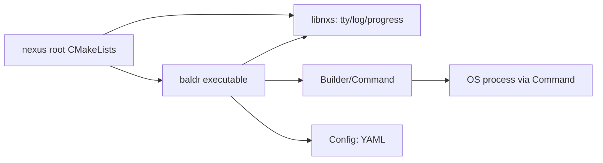

# Requirements

### Overview & Goals
The `baldr` branch currently lands the whole C++ port of `baldr` as one lump (8 commits, ~3.5k lines, 39 files) built as a **fully separate CMake subproject** (`baldr-cpp/CMakeLists.txt`, its own `dependencies.cmake`, its own `install.cmake`). The goal is to re-cut this work into the smallest possible commits, each shipping real, buildable value, while also fixing the structural issue: `baldr` must live **inside** the main `nexus` CMake project (like `btx`, `liblexy`, `libnxs`), and its reusable TTY/log/progress primitives must live in a shared library so other tools/modules can reuse them.

### Scope
**In scope**
- Restructuring `baldr-cpp` into the main project layout (root `CMakeLists.txt`, root `dependencies.cmake`).
- Extracting `tty`, `log`, and `progress` into `libnxs` as reusable, non-`baldr`-specific utilities.
- Splitting the remaining functionality (`Config`, `Builder`/`Command`, `run`/`debug`/`test` subcommands, `docker` client, documentation) into incremental, independently buildable commits.

**Out of scope**
- New features beyond what already exists on the `baldr` branch (`baldr-unified-logging-api` and `fix-command-line-buffering` plan files are separate, not-yet-implemented work and are not part of this split).

### Functional Requirements
- After every commit, the whole `nexus` project must configure and build successfully (`cmake --build`), and `baldr --help` must run once the executable exists.
- No commit should introduce dead/unused code that isn't wired into the CLI or a library consumer.
- Reusable terminal utilities (`tty`, `log`, `progress`) must be usable independently of `baldr` (i.e. living in `libnxs`, not `baldr`'s own folder).

# Technical Design

### Current Implementation (on `baldr` branch)
- `baldr-cpp/CMakeLists.txt` is a **standalone** top-level CMake project (`project("baldr-cpp" ...)`) with its own `dependencies.cmake`/`install.cmake`, only nested under the repo directory, not under `nexus`'s `add_subdirectory` tree.
- `baldr-cpp/baldr/` contains everything as one flat executable target: `main.cpp`, `builder.cpp/.hpp`, `config.cpp/.hpp`, `command.hpp`, `docker.cpp/.hpp`, `tty.cpp/.hpp`, `log.cpp/.hpp`, `progress.cpp/.hpp`, `utils.cpp/.hpp`, plus tests (`line_reader.test.cpp`, `tty.test.cpp`, `regression.test.cpp`).
- `nexus` root `CMakeLists.txt` currently does `add_subdirectory` for `libbtx`, `liblexy`, `libnxs`, `btx`, `msg-gen` only — no `baldr-cpp` hookup exists on `master`.
- `libnxs` is the project's general-purpose utility library (`args.hpp`, `refl.hpp`), currently header-only (`add_library(nxs INTERFACE)`).
- `libbtx`/`btx` show the established **lib + tool** split pattern: a compiled library (`add_library(btx ...)`, `FILE_SET HEADERS`, linked `PUBLIC nova::nova`) consumed by a thin executable module (`btx/main.cpp` linking `PRIVATE btx`).

### Key Decisions
- **In-tree module, not a nested project**: Drop `baldr-cpp`'s own `project()`/`dependencies.cmake`/`install.cmake`; add a top-level `baldr/` module (executable) via `add_subdirectory(baldr)` in root `CMakeLists.txt`, using the root `dependencies.cmake` (already has `boost::program_options`, `yaml-cpp`, `fmt`, `nova`, `GTest`, so no new entries needed).
- **TTY/log/progress move into `libnxs`**: These are generic terminal/TUI primitives, not `baldr`-specific, so they become `nxs::tty`, `nxs::log`, `nxs::progress` inside `libnxs`. Since these ship `.cpp` implementations (not header-only), `libnxs` changes from `add_library(nxs INTERFACE)` to a regular compiled library (mirroring `libbtx`'s pattern), while keeping existing header-only utilities (`args.hpp`, `refl.hpp`) as-is.
- **`baldr` depends on `nxs`**: The `baldr` executable target links `PRIVATE nxs boost::boost yaml-cpp::yaml-cpp` (no `program_options`/`fmt` duplication beyond what's needed), following the `btx-tool` → `btx` dependency pattern.
- **Namespace update**: `baldr::tty`/`baldr::log`/`baldr::progress` become `nxs::tty`/`nxs::log`/`nxs::progress`; all `#include <baldr/...>` for these three headers become `#include <nxs/...>` throughout `baldr`'s remaining sources.

### File Structure (target, after full split)
```
libnxs/
  tty.hpp / tty.cpp        (moved from baldr-cpp/baldr)
  tty.test.cpp
  log.hpp / log.cpp
  progress.hpp / progress.cpp
  CMakeLists.txt           (updated: compiled lib, new sources)
baldr/
  CMakeLists.txt
  main.cpp
  command.hpp
  config.hpp / config.cpp
  builder.hpp / builder.cpp
  utils.hpp / utils.cpp
  line_reader.hpp / line_reader.test.cpp
  docker.hpp / docker.cpp
  regression.test.cpp
  tui_debug.hpp
  test.cmake
doc/
  book.adoc, user-guide.adoc, developer-guide.adoc
res/
  dark-doc.css
tests/
  log-mode.sh, rolling-window.sh
```
The standalone `baldr-cpp/` directory (its `CMakeLists.txt`, `conanfile.txt`, `dependencies.cmake`, `install.cmake`) is removed entirely; root `CMakeLists.txt` and `dependencies.cmake` absorb what's needed.

### Architecture Diagram


# Delivery Steps

### ✓ Step 1: Migrate `tty` into `libnxs` as a reusable, compiled utility
`nxs::tty` exists in `libnxs`, buildable and tested independently of `baldr`, with no other module touched yet.

- Move `tty.hpp/.cpp` and `tty.test.cpp` from `baldr-cpp/baldr/` into `libnxs/`, renaming the namespace from `baldr::tty` to `nxs::tty`.
- Update `libnxs/CMakeLists.txt` from an `INTERFACE` library to a regular compiled library (mirroring `libbtx`'s `add_library(btx ...)` + `FILE_SET HEADERS` pattern) so it can host `tty.cpp`, keeping existing header-only utilities (`args.hpp`, `refl.hpp`) unaffected.
- Wire `tty.test.cpp` into `libnxs`'s `test.cmake`/GTest registration, following the existing `args.test.cpp`/`refl.test.cpp` pattern.
- `baldr-cpp` still owns its own standalone project at this point; no changes to `baldr-cpp/baldr/tty.*` consumers yet — this commit is purely additive (duplication is acceptable for one commit and removed in the next step).
- Verify `cmake --build` succeeds for the whole `nexus` tree and the new `libnxs` tty unit tests pass.

### ✓ Step 2: Migrate `log` and `progress` into `libnxs` (merged as `nxs::rlog`) and remove the duplicated `tty`
`log` and `progress` were merged into a single `nxs::rlog` module ("Scrollog" — scrolling/rolling-window log) joining `nxs::tty` in `libnxs`; the old `baldr-cpp` copies of all three are deleted so there is a single source of truth.

- Move `log.hpp/.cpp` and `progress.hpp/.cpp` from `baldr-cpp/baldr/` into `libnxs/rlog.hpp/.cpp`, merging both into namespace `nxs::rlog` (`mode`/`init()` from `log`, plus the rolling-window renderer renamed to `rlog::window`). `scrollog_sink` is a public, reusable spdlog sink (not an implementation detail); mode resolution is folded into `init(name, std::optional<mode>)`, auto-resolving via the `SPDLOG_MODE` environment variable (matching the existing `SPDLOG_LEVEL` naming convention, since this env var is not `BALDR`-specific and is expected to migrate into Nova eventually) when no explicit mode is given.
- `success()`/`failure()` messages are formatted through the sink's own `formatter_` via a synthetic `log_msg` (no recursive spdlog dispatch), keeping the same timestamp/pattern as regular log records; free `nxs::rlog::success(msg, logger_name)`/`nxs::rlog::failure(msg, logger_name)` functions (via a shared `find_scrollog_sink()` helper) look up the active `scrollog_sink` on the named logger (`logger_name` empty defaults to `spdlog::default_logger()`, supporting multi-topic loggers), falling back to a plain `info`/`error` log in `mode::standard` so callers don't need to track the current mode themselves. A logger is assumed to carry at most one `scrollog_sink`. Collapsing into `success()`/`failure()` is always explicit — `sink_it_` never auto-triggers `failure()` for `error`/`critical` records; every record just joins the rolling window.
- `window` separates on-screen display size from replay capacity: `visible_lines()` (renamed from `lines()`) controls how many lines are rendered in-place, while a larger `max_buffer()` (default 1000) retains full history so `failure()` can dump everything that led up to it, not just what was on screen. Both `success()`/`failure()` clear the buffer afterwards so the next tracked task starts with a clean slate. Added `libnxs/rlog.ex.cpp` (`example-rlog` target) demonstrating the scrolling window, success, and failure behavior end-to-end.
- Update `libnxs/CMakeLists.txt` sources to include `rlog.cpp`.
- Delete the now-duplicated `baldr-cpp/baldr/tty.hpp/.cpp`, `tty.test.cpp`, `log.hpp/.cpp`, `progress.hpp/.cpp`, and update `baldr-cpp/baldr/CMakeLists.txt` to link `nxs` and drop the removed sources.
- Update `#include <baldr/tty.hpp>` / `log.hpp` / `progress.hpp` references inside remaining `baldr-cpp` sources to `#include <libnxs/tty.hpp>` / `#include <libnxs/rlog.hpp>`, and qualify call sites with `nxs::`/`nxs::rlog::`.
- Verify `cmake --build` succeeds and `baldr-cpp`'s existing tests/executable still work against the `libnxs`-hosted primitives.

### ✓ Step 3: Scaffold `baldr` as an in-tree CLI shell and retire the standalone `baldr-cpp` project
The `baldr` executable exists inside the main `nexus` CMake project (no nested project); the old standalone `baldr-cpp` project files are gone.

- Created a new top-level `baldr/` module (`CMakeLists.txt` + `main.cpp`) added via `add_subdirectory(baldr)` in the root `CMakeLists.txt`, using the root `dependencies.cmake` (already has `boost::program_options`, `yaml-cpp`, `fmt`, `nova`, `GTest`).
- Implemented a minimal `main.cpp`: CLI shell parsing `--help`/`--version`/`--log-mode` via `boost::program_options`, initializing `nxs::rlog` and printing usage — no real subcommands yet; links `PRIVATE nxs Boost::program_options`.
- Deleted the leftover `baldr-cpp/` directory (only a stray `conan_provider.cmake` remained in this checkout; the old standalone project's sources were never present here) since the root project now owns configuration.
- Verified `cmake --build` succeeds for the whole `nexus` tree, all 17 `nxs` tests still pass, and `baldr --help`/`--version`/plain invocation all run correctly.
- Calling `baldr` with no arguments at all is a usage error: it dumps the help message to stderr and exits with a non-zero status, rather than silently doing nothing.
- `--version` reuses the root `NEXUS_VERSION` (single source of truth) plus a `git rev-parse --short HEAD` hash (falling back to `"unknown"` outside a git checkout), both wired in via `target_compile_definitions` in `baldr/CMakeLists.txt`.
- The git-hash lookup lives in its own reusable `cmake/GitVersion.cmake` module (`nexus_git_hash()` function, added to `CMAKE_MODULE_PATH`), kept dependency-free so it can be migrated out into a standalone CMake module later.
- Added `tools/bump-version.sh` to bump `NEXUS_VERSION` (`major`/`minor`/`patch`, or `auto` \u2014 inferring the level from the latest Conventional Commits message: `!`/`BREAKING CHANGE` \u2192 major, `feat:` \u2192 minor, else patch), plus a `--check` flag that only verifies the version was actually bumped compared to `HEAD`, without modifying anything.

### ✓ Step 4: Wire up a `build` command stub and refactor CLI argument parsing
`baldr build` runs as a positional command (not `--command build`) and logs a clear "not yet implemented" warning; `main.cpp` is refactored so argument parsing is a separate, testable concern from command dispatch. The real process wrapper (`command`/`line_reader`) and `Builder` implementation are deferred to a following step to keep this one small and reviewable.

- Refactored `main.cpp` to follow the `nova::NOVA_MAIN`/`entrypoint(auto args)` convention already used by `btx`/`msg-gen` (`libnova/main.hpp`): `entrypoint()` receives `argv` as a range of `std::string_view`, `NOVA_MAIN(entrypoint)` provides the actual `main()` with centralized exception handling, and parse errors are reported via `nova::log::error()` + `std::nullopt` rather than ad-hoc exit-code plumbing.
- Extracted `parse_args()` returning an `std::optional<parsed_args>` struct (`help`/`command`/`log_mode`), so `entrypoint()` only initializes `nxs::rlog` and dispatches the resolved command.
- Added a `<command>` positional argument (`baldr build`, not `baldr --command build`) via `boost::program_options`' `positional_options_description`.
- Added `baldr/builder.hpp/.cpp` as a stub: `configure()`/`build()` just log a `nova::log::warn` "not yet implemented" and return `false`; wired the `build` command into `entrypoint()`'s dispatch, calling both and failing if either does.
- `command.hpp`/`line_reader.hpp` (the actual process-spawning wrapper) and a working `Builder` are deferred to the next step, once there's a concrete need to plug them into (avoids a premature/oversized commit).

### ✓ Step 5: Implement Command/line_reader process wrapper and a real, build-system-agnostic `build` command
`baldr build` actually builds a target project end-to-end via a real process wrapper — deliberately scoped to *build only* (no `configure()`/`Config`/YAML yet) and deliberately build-system-agnostic (a plain command vector, not hardcoded to CMake), verified manually against a new Makefile-based mini test project.

- Ported `line_reader.hpp` (+ `line_reader.test.cpp`, 8 tests) from the `baldr` branch into `libnxs` as `nxs::line_reader` \u2014 a reusable, callback/`feed()`-based line reassembler decoupled from any I/O source, rather than `baldr`'s own fd-specific reader.
- Added `baldr/command.hpp`, ported from the `baldr` branch to match its original design: a pull-based `poll()`/`wait()` API (not push-based), an RAII nested `pipe` class, and an `interactive` mode that leaves the child attached to the parent's TTY instead of piping; environment variable overrides (`CC`/`CXX`) supported via a `std::map` constructor argument.
- Added `baldr/command.ex.cpp` (`example-command` target, mirroring `libnxs/rlog.ex.cpp`) demonstrating the intended `cmd.run()` + `poll()`-loop-feeding-`nxs::line_reader` + `cmd.wait()` pattern end-to-end, since this pull-based design isn't easily unit-testable in isolation.
- Added `baldr/builder.hpp/.cpp`: `builder` takes a `project_dir` and a plain `build_command` vector (default `{"make"}`, no CMake-specific assumptions), runs it via `sh -c "cd <dir> && <command>"` (keeping `command` itself directory-agnostic) and streams output through `nxs::line_reader` into `nova::log::info`.
- Added `baldr/testdata/mini-project/` (a trivial `Makefile` + `main.cpp`) to manually verify `baldr build` against a real, non-CMake build system — confirmed working end-to-end (compiles and the resulting binary runs correctly).
- `Config`/YAML loading, a `configure` subcommand, and CMake-specific defaults are deferred to a following step, once `Builder` actually needs them (avoiding the earlier dead-code trap in reverse: a `Config` would again have nothing real to configure yet if bundled here for CMake specifically, while `build` already works standalone against arbitrary build systems).

### ✓ Step 6: Add run subcommand (debug/test deferred)
`baldr run` works end-to-end against an explicitly given target; `debug`/`test`/`clean` subcommands and `utils.hpp`/`regression.test.cpp` are deferred to keep this increment focused on `run` only.

- Implemented `builder::run(target)`: runs the given target (no auto-discovery — the target must be passed explicitly) interactively (attached to the caller's TTY) via `command`.
- `builder::build()`/`builder::run()` return `void` and signal failure via `nova::exception` instead of `bool`, since callers (`main.cpp`, propagated up through `NOVA_MAIN`) never need to handle these errors beyond reporting and exiting non-zero.
- Wired a `run` command into `main.cpp`, requiring `-t/--target <name>` (parse error if omitted) and a `--build` flag (builds before running); updated `print_help()` accordingly.
- Verified manually against `baldr/testdata` (Makefile-based mini project): `baldr -p baldr/testdata run -t hello --build` builds then runs; omitting `-t` now correctly errors with "'run' requires -t/--target <name>"; whole tree builds and all 55 tests still pass.
- `debug()`/`test()`/`clean` subcommands, `regression.test.cpp`, and shell-level regression tests (`tests/rolling-window.sh`, `tests/log-mode.sh`) remain deferred/out of scope for this split.

### ✓ Step 7: Add docker subcommand
`baldr docker` runs a command inside a fresh container via the Docker Engine API, streaming its combined stdout/stderr and propagating its exit code.

- Added `baldr/docker.hpp/.cpp`: a `docker_client` class (connect over the Unix socket, `ping()`/`pull_image()`/`create_container()`/`start_container()`/`wait_container()`/`stream_logs()`) ported and cleaned up from the `baldr` branch's free-function/inline-header implementation, using `boost::beast`'s HTTP client over `boost::asio::local::stream_protocol` and `nlohmann::json`; a `docker_run(image, cmd)` free function orchestrates the full pull/create/start/stream/wait sequence and throws `nova::exception` on daemon/creation failures (matching `builder`'s exception-based error style).
- Wired a `docker` command into `main.cpp`, requiring `-i/--image <name>` plus a trailing container command (`baldr docker -i <image> <cmd...>`, parsed via a `-1` positional `args` option); updated `print_help()` accordingly.
- Linked `Boost::headers` (for `asio`/`beast`) and `nlohmann_json::nlohmann_json` (already available via the root `dependencies.cmake`/`conanfile.txt`) into the `baldr` target; no new dependencies were needed.
- Verified end-to-end against a real local Docker daemon: `baldr docker -i alpine:3.20 echo hello-from-container` pulls, creates, starts, streams the container's log line, and exits `0`; missing `-i`/missing command both correctly error at parse time. Whole tree builds and all 55 tests still pass.
- The top-level `run` script and `baldr/tui_debug.hpp` debug helper from the original plan wording were dropped from scope: `tui_debug` was already removed from `nxs::tty` earlier in this split (Step 1 review), and no `run` script is needed since `docker_run` isn't TUI-based.

###   Step 8: Reorganize project documentation into a master AsciiDoc book
All `baldr` commands (including `docker`) are documented in a unified, navigable book.

- Create `doc/book.adoc` as the master entry point, replacing the ad-hoc `doc/baldr.adoc`.
- Split content into `doc/user-guide.adoc` (CLI usage per command) and `doc/developer-guide.adoc` (architecture, module layout referencing `libnxs`/`baldr`).
- Add `res/dark-doc.css` as the documentation theme.
- Update `tools/doc.sh` to compile the new multi-file book structure.