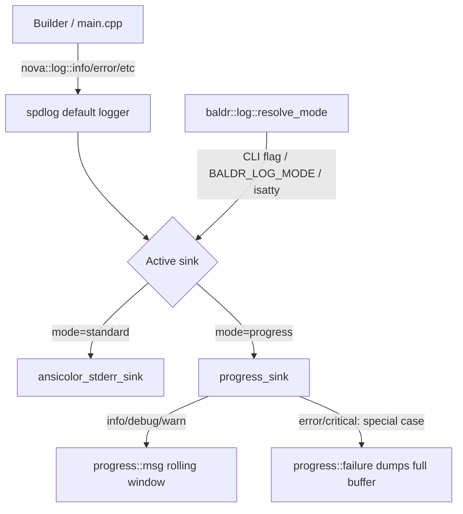

# Requirements

### Overview & Goals
Baldr currently mixes two disconnected output mechanisms: `nova::log::*` (spdlog-based, used for structured logs in `main.cpp`) and `baldr::progress` (custom ANSI in-place TUI updates, injected into `Builder`). The goal is to unify these behind a single, `nova::log`-compatible API where callers keep writing `nova::log::info(...)`-style calls, but the actual rendering (plain spdlog lines vs. in-place progress lines) is chosen **at runtime** through a custom spdlog sink, with the design kept generic enough to be backported into `libnova` later.

### Scope
**In Scope**
- A custom spdlog sink (`progress_sink`) that renders log records through `baldr::progress` (in-place, overwritable lines) instead of a plain stream sink.
- A `baldr::log` initialization module that builds the baldr logger with either the standard `ansicolor_stderr_sink` or the new `progress_sink`, chosen at runtime.
- Runtime mode selection: default to progress-style when stdout is a TTY, plain/standard logging otherwise (CI, pipes, redirection), with an explicit override.
- Migration of existing call sites (`builder.cpp`, `main.cpp`) from direct `m_progress.msg/success/failure(...)` calls to the unified `nova::log::*` API.
- Keep the existing `baldr::progress` class as the internal rendering engine used by the sink; it is no longer passed around as a public collaborator.
- Treat *failure* as the special case, not success: while things are going well, `progress` only shows the rolling window of the latest lines (nothing needs to be dumped in full). Only on `error`/`critical` does the sink dump the entire buffered log history to the terminal so the user can see everything that led up to the failure.

**Out of Scope**
- Actually upstreaming the sink into `libnova` (design only; kept generic/backportable).
- Changing `nova::log`'s public function signatures.
- Structured/JSON logging or log file sinks.

### User Stories
- As a Baldr developer, I want to call `nova::log::info(...)` everywhere (in `Builder`, `main.cpp`) so that logging call sites are uniform and not aware of TTY vs. CI concerns.
- As a Baldr user running interactively, I want build/configure/run output to show as smoothly updating progress lines instead of scrolling spam.
- As a CI user (non-TTY), I want plain, timestamped, appendable log lines (current `nova::log` format) instead of ANSI cursor-control sequences corrupting logs.
- As a Baldr user, I want to force one mode or the other regardless of TTY detection (e.g. when piping to `less` interactively, or forcing progress mode in a pseudo-TTY CI runner).

### Functional Requirements
- `baldr::log::init(...)` configures the default spdlog logger with a sink chosen by mode: `standard` (existing `ansicolor_stderr_sink`, unchanged format/behavior) or `progress` (new `progress_sink` backed by `baldr::progress`).
- Mode resolution order: explicit override (CLI flag) > environment variable > TTY auto-detection (`isatty(STDERR_FILENO)`) > default to `standard`.
- In `progress` mode, `critical`/`error` records flush as `progress::failure` (dumping the full buffered history — the special case), and all other levels (`info`/`debug`/`warn`/`trace`) map to `progress::msg` (rolling window, nothing special dumped). No dedicated "success" signal is required: when nothing fails, `progress::msg`'s rolling buffer is simply left as-is (or cleared quietly) — the low-noise, happy-path behavior is the default, not an exception.
- In `standard` mode, behavior is byte-identical to today's `nova::log::init("baldr")` output.
- All existing `nova::log::*` call sites keep compiling unchanged; only `builder.cpp`'s `m_progress.msg/success/failure` calls and the `Builder`/`stream_command`/`run_local`/`run_docker`/`run_test` signatures that thread a `progress&` are updated to use `nova::log::*` instead.

# Technical Design

### Current Implementation
- `deps/nova-cpp/libnova/libnova/log.hpp`: free-function `nova::log::{critical,error,warn,info,debug,trace,devel}(fmt, args...)` wrapping `spdlog`, plus `topic_log` variants. `nova::log::init(name, env_config)` sets the default logger to an `ansicolor_stderr_sink_mt` with a fixed pattern.
- `baldr-cpp/baldr/progress.{hpp,cpp}`: a `progress` class with `msg()`, `success()`, `failure()` that renders a scrolling window of lines using raw ANSI escape codes (`ansi::clear_line/cursor_up/cursor_down`) directly via `fmt::print`. It is constructed once in `main.cpp` (`auto progress = baldr::progress{};`) and passed by reference into `Builder`, `stream_command`, `run_local`, `run_docker`, `run_test`.
- `baldr-cpp/baldr/main.cpp`: calls `nova::log::load_env_levels()` + `nova::log::init("baldr")` once in `entrypoint()`, then uses `nova::log::error/debug` for CLI parsing/diagnostics, while `Builder`/command-runner functions use `progress.msg/success/failure` for user-facing status. The two systems never interact.

### Key Decisions
- **API shape — custom spdlog sink instead of a parallel facade.** Rather than introducing a new `baldr::log` namespace duplicating `nova::log`'s function signatures, implement a `spdlog::sinks::base_sink<std::mutex>` subclass (`progress_sink`) that formats each log record and forwards it to a `baldr::progress` instance. Callers keep using `nova::log::*` verbatim (true drop-in compatibility, zero call-site divergence). The runtime switch happens only in `baldr::log::init(...)`, which decides which sink(s) to attach to the default logger. This is deliberately written in a self-contained header so it can later be moved into `libnova` as a reusable sink.
- **Mode resolution — TTY auto-detect with explicit override.** Default: `isatty(fileno(stderr))` → `progress` mode, otherwise `standard`. Override precedence: `--log-mode=standard|progress` CLI flag (if provided) beats a `BALDR_LOG_MODE` environment variable (consistent with the existing `SPDLOG_LEVEL` env-var convention used by `nova::log`), which beats TTY detection.
- **Level → progress-call mapping — failure is the special case, not success.** `critical`/`err` levels forward to `progress::failure(msg)`, which is the *only* path that dumps the whole buffered log history to the terminal (the point of `progress` is that when everything is fine, the user never needs to see the accumulated log lines). `info`/`debug`/`warn`/`trace` forward to `progress::msg(msg)`, which keeps only a small rolling window visible. No dedicated "success" signal is introduced in this pass; a plain completion message is just another `nova::log::info(...)` call through `progress::msg`. Refining exactly how a clean/successful run's buffer is finally cleared (still via `progress::success`, but not treated as a distinct logging concept) is left for a follow-up once the base implementation is working.
- **`baldr::progress` becomes an implementation detail.** It stops being threaded through `Builder`/`main.cpp` constructors; instead a single `progress` instance is owned inside the sink (or by `baldr::log` initialization) and only reachable via the logging API.

### Proposed Changes
1. Add `baldr::log::mode` enum (`standard`, `progress`) and `baldr::log::init(mode, name = "baldr")` in a new `baldr/log.hpp` / `log.cpp`, replacing the direct `nova::log::init("baldr")` call in `main.cpp`'s `entrypoint()`.
2. Add `baldr::log::resolve_mode(std::optional<mode> cli_override)` implementing the precedence rule (CLI override → `BALDR_LOG_MODE` env var → `isatty` check → `standard` default).
3. Implement `progress_sink : public spdlog::sinks::base_sink<std::mutex>` in `baldr/log.cpp`, overriding `sink_it_` (format via the logger's formatter, then call `m_progress.msg` for normal levels or `m_progress.failure` — the buffer-dumping special case — for `error`/`critical`) and `flush_` (no-op or flush stdout).
4. Update `builder.cpp`/`builder.hpp`: remove the `progress&` constructor parameter and `m_progress` member from `Builder`; replace `m_progress.msg(...)` with `nova::log::info(...)` and `m_progress.failure(...)` with `nova::log::error(...)`. Completion/"successful" messages remain plain `nova::log::info(...)` calls (no new API) — how the buffer is finally cleared on a clean run is left as a follow-up refinement.
5. Update `main.cpp`: remove the standalone `auto progress = baldr::progress{};` object and its threading through `stream_command`, `run_local`, `run_docker`, `run_test`; replace those `progress.msg/success/failure` calls with `nova::log::info`/`nova::log::error` (keeping today's `progress.success(...)` calls as `nova::log::info(...)` for now). Add the `--log-mode` CLI option next to existing global options and wire it into `baldr::log::init`.
6. Keep `baldr/progress.hpp/.cpp` unchanged in its own rendering logic (buffer, ANSI helpers) — it is now only instantiated once, internally by `baldr::log`; its `success()` method is kept as-is but not wired to a distinct logging concept yet.

### Data Models / Contracts
```cpp
// baldr/log.hpp
namespace baldr::log {

enum class mode { standard, progress };

/// Resolve effective mode: cli_override > BALDR_LOG_MODE env > isatty(stderr) > standard.
auto resolve_mode(std::optional<mode> cli_override = std::nullopt) -> mode;

/// Initialize the default spdlog logger with the sink matching `m`.
void init(mode m, const std::string& name = "baldr");

} // namespace baldr::log
```
```cpp
// baldr/log.cpp (sketch)
class progress_sink : public spdlog::sinks::base_sink<std::mutex> {
protected:
    void sink_it_(const spdlog::details::log_msg& msg) override;
    void flush_() override;
private:
    baldr::progress m_progress;
};
```

### Components
- **`baldr/log.hpp` / `log.cpp` (new)** — mode enum, `resolve_mode`, `init`; owns the `progress_sink`.
- **`baldr/progress.hpp` / `progress.cpp` (unchanged internals)** — no longer a public collaborator of `Builder`/`main.cpp`; consumed only by `progress_sink`.
- **`baldr/builder.hpp` / `builder.cpp` (modified)** — drop `progress&` dependency, use `nova::log::*`.
- **`baldr/main.cpp` (modified)** — add `--log-mode` CLI option, call `baldr::log::init(resolve_mode(...))`, drop the standalone `progress` object and its threading through helper functions.

### Architecture Diagram


### Risks
- The happy path (no errors) must stay low-noise: `sink_it_` must not accidentally dump the buffer for non-error levels, or the whole point of `progress` (hide log spam unless something fails) is defeated.
- `progress::msg`/`failure` assume being driven from a single thread/sequence of related lines; multiple concurrent loggers (e.g. topic loggers) writing to the same `progress_sink` could interleave — mitigate by keeping `progress_sink` mutex-guarded (via `base_sink<std::mutex>`) and scoping progress mode to the default logger only (topic loggers unaffected).
- Removing `progress&` from `Builder`'s public constructor is a breaking API change for that class — must update all call sites in the same change (`main.cpp`) to avoid a broken build.
- Exactly how/when `progress::success(...)` (final buffer clear on a clean run) gets wired into the unified API is intentionally left open for a follow-up refinement, per the user's guidance.

# Testing

### Validation Approach
Since rendering behavior (ANSI cursor control) is hard to assert in unit tests, focus tests on the pure logic: mode resolution precedence and the sink's level → progress-call mapping, plus a build-level smoke check that both modes compile and run.

### Key Scenarios
- `resolve_mode` returns the CLI override when provided, regardless of env var or TTY state.
- `resolve_mode` returns `BALDR_LOG_MODE`'s value when no CLI override is given and it is set.
- `resolve_mode` falls back to TTY detection, then to `standard`, when neither override nor env var is present.
- `nova::log::error(...)`/`nova::log::critical(...)` while `progress_sink` is active result in a call to `progress::failure` (full buffer dump — the special case).
- `nova::log::info(...)`/`debug(...)`/`warn(...)` while `progress_sink` is active result in `progress::msg` (rolling window only, no dump).
- `builder.cpp` compiles and runs `configure`/`build` end-to-end in both `--log-mode=standard` and `--log-mode=progress` without crashing, and a run with no errors never dumps the accumulated log buffer to the terminal.

### Edge Cases
- Invalid `BALDR_LOG_MODE` value (neither `standard` nor `progress`) falls back gracefully (log a warning via `nova::log::warn` and use `standard`).
- Redirected stderr (non-TTY) with no override defaults to `standard` even if stdout is a TTY (only stderr is checked, matching where `nova::log`'s sink writes).
- Empty messages passed to `progress::success`/`failure` (already handled today by the existing `if (not msg.empty())` guards) continue to work unchanged.

# Function Tests

### Overview
The unified logging API (`baldr::log`) and its migration into `Builder`/`main.cpp` are already implemented (Steps 1-4 below, all complete). This phase adds an **end-to-end functional test suite** — following the project's existing shell-script E2E convention (`tests/btx.sh`, `tests/stdout.sh`) — that exercises the real `baldr` binary and demonstrates both logging modes with observable, assertable output, rather than unit-testing internals in isolation. This standalone script is run directly; it is not wired into `tests/run.sh`.

### Why Shell E2E, Not a Unit Test Binary
Baldr has no existing unit-test target of its own (`tests/*.sh` are all black-box E2E scripts invoking built executables and asserting on captured stdout/stderr). The logging behavior under test is fundamentally about *what bytes hit the terminal* (ANSI cursor-control sequences vs. plain appendable lines), which is best demonstrated the same way: build `baldr`, run it as a subprocess with `--log-mode` forced (since TTY auto-detection can't be relied on under a non-interactive test runner), and assert on the captured output bytes — mirroring `tests/btx.sh`'s `run_test_to_bin`/`run_negative_test` helper pattern.

### Key Scenarios To Demonstrate
- **Standard mode, happy path**: `baldr --log-mode=standard test` produces plain, timestamped `nova::log` lines (`[YYYY-MM-DD ...] [info] Testing logging... N` / `Test finished`) with **no** ANSI cursor-control sequences (no `\x1b[2K`, `\x1b[nA`, `\x1b[nB`).
- **Progress mode, happy path**: `baldr --log-mode=progress test` output **does** contain `progress`'s cursor-control escape sequences (clear-line / cursor-up), demonstrating the in-place rolling-window rendering.
- **Standard mode, failure path**: a command that fails (e.g. `baldr --log-mode=standard debug` in a build dir with no executables) prints a plain `[error]` line via `nova::log::error`, with no buffer replay (nothing to replay — `nova::log` was already printing every line).
- **Progress mode, failure path — the special case**: the same failing command under `--log-mode=progress` triggers `progress::failure`'s full buffered-history dump, visible as the buffered lines re-printed in red (`\033[0;31m`) followed by the failure message (`\033[1;31m`), demonstrating that failure (not success) is what surfaces the hidden log history.
- **Mode resolution precedence**: `--log-mode=standard` overrides `BALDR_LOG_MODE=progress`; `BALDR_LOG_MODE=progress` (no CLI flag) alone selects progress mode; an invalid `--log-mode=bogus` value is rejected with a clear CLI error and non-zero exit.

### Edge Cases To Cover
- Invalid `BALDR_LOG_MODE=bogus` (no CLI override) falls back to `standard` (per `resolve_mode`'s edge-case handling) rather than failing the run.
- Non-TTY default (no override, no env var — the actual condition under the test runner) resolves to `standard`, confirmed by a baseline run with neither flag nor env var set.

# Delivery Steps

### ✓ Step 1: Implement the progress-backed spdlog sink and mode resolution
A new `baldr::log` module exists that can initialize the default logger with either the standard color sink or a progress-rendering sink, selected at runtime.
- Add `baldr/log.hpp` declaring `mode` enum, `resolve_mode(std::optional<mode>)`, and `init(mode, name)`.
- Add `baldr/log.cpp` implementing `progress_sink : spdlog::sinks::base_sink<std::mutex>` that owns a `baldr::progress` instance and maps spdlog levels to `progress::msg`/`progress::failure` in `sink_it_` — only `error`/`critical` trigger `progress::failure`'s full buffer dump, all other levels just update the rolling window via `progress::msg`.
- Implement `resolve_mode` with precedence: explicit argument > `BALDR_LOG_MODE` env var > `isatty(fileno(stderr))` > `standard` default, warning via `nova::log::warn` on invalid env values.
- Implement `init(mode, name)` to build the default spdlog logger with `ansicolor_stderr_sink` (standard) or `progress_sink` (progress), keeping the existing log pattern/format for standard mode.
- Register `log.cpp` in `baldr-cpp/baldr/CMakeLists.txt`.

### ✓ Step 2: Add CLI mode selection and wire initialization in main.cpp
Baldr's entrypoint resolves and applies the logging mode before running any command, and a `--log-mode` flag is documented in help output.
- Add a `--log-mode=standard|progress` global CLI option to `baldr_options` and its parsing logic in `main.cpp`.
- Update `show_help()` to document the new flag.
- Replace `nova::log::init("baldr")` in `entrypoint()` with `baldr::log::init(baldr::log::resolve_mode(cli_override))`.
- Remove the standalone `auto progress = baldr::progress{};` construction in `entrypoint()`.

### ✓ Step 3: Migrate Builder to the unified logging API
`Builder` no longer depends on an injected `progress&`; all of its status/error output goes through `nova::log::*`.
- Remove the `progress&` parameter and `m_progress` member from `Builder`'s constructor/header (`builder.hpp`).
- Replace every `m_progress.msg(...)` call in `builder.cpp` with the equivalent `nova::log::info(...)`.
- Replace `m_progress.failure(...)` calls with `nova::log::error(...)` (the sink's buffer-dumping special case).
- Replace explicit "successful" completion messages with plain `nova::log::info(...)` calls (no dedicated success API for now).

### ✓ Step 4: Migrate remaining main.cpp helpers off progress and update the Builder construction site
`stream_command`, `run_local`, `run_docker`, and `run_test` use the unified logging API instead of a threaded `progress&` parameter, and `Builder` is constructed without a progress object.
- Update `stream_command`, `run_local`, `run_docker` signatures to drop the `baldr::progress&` parameter, replacing `progress.msg(...)` with `nova::log::info(...)`.
- Update `run_test` to use `nova::log::info`/`nova::log::error` instead of `progress.msg/success/failure`, keeping its role as a mode-demo command.
- Update the `Builder{config, progress}` construction and all call sites in `entrypoint()`'s command `switch` to match the new signatures.
- Verify the project builds cleanly with both `--log-mode=standard` and `--log-mode=progress`.

### ✓ Step 5: Write the happy-path functional test script for both logging modes
A new `tests/log-mode.sh` script exists that builds `baldr` and demonstrates standard vs. progress mode on the `test` command's happy path.
- Follow the `tests/btx.sh` structure: build `baldr` once via the `baldr` build wrapper into an `OUTPUT_DIR` under `.tmp/test-outputs/`, with `PASSED`/`FAILED`/`FAILED_TESTS` bookkeeping and a `summary()` function with a non-zero exit on failure.
- Add a `run_standard_mode_test` case: run `./baldr/baldr --log-mode=standard test`, capture stdout+stderr, assert the output contains the plain `Testing logging...`/`Test finished` lines and does **not** contain the raw bytes `\x1b[2K`/cursor-movement escape sequences (via `grep -P` on a hex/`cat -v` dump).
- Add a `run_progress_mode_test` case: run `./baldr/baldr --log-mode=progress test`, assert the captured output **does** contain the clear-line/cursor escape sequences, confirming in-place rendering occurred.
- Add a baseline case with neither `--log-mode` nor `BALDR_LOG_MODE` set, asserting it falls back to standard-mode-shaped output (matches the non-TTY default under the test runner).

### ✓ Step 6: Extend the script with failure-path and mode-resolution-precedence scenarios
The same script demonstrates that failure (not success) is the special case that dumps the buffer, and that mode resolution precedence is respected.
- Add a failing-command fixture (e.g. `baldr --log-mode=<mode> debug` against a build dir with no executables, reusing `Builder::debug`'s existing "No executables found" error path) run once per mode.
- In `--log-mode=standard`, assert the failure fixture's output is a single plain `[error] No executables found in ...` line with no color-dump/replay artifacts.
- In `--log-mode=progress`, assert the failure fixture's output contains the red buffer-dump escape codes (`\033[0;31m` for replayed lines, `\033[1;31m` for the failure message), demonstrating the special-case full-history dump.
- Add precedence cases: `BALDR_LOG_MODE=progress ./baldr/baldr test` (env alone selects progress-shaped output) and `BALDR_LOG_MODE=progress ./baldr/baldr --log-mode=standard test` (CLI flag overrides env, output is standard-shaped).
- Add an invalid-value case: `./baldr/baldr --log-mode=bogus test` exits non-zero with a `nova::log::error("Invalid value for --log-mode: 'bogus'")`-style message on stderr, using a `run_negative_test`-style helper matching `tests/btx.sh`'s convention.
- Note: `tests/log-mode.sh` is a standalone script, run directly (e.g. `bash tests/log-mode.sh`); it is intentionally not registered in `tests/run.sh`.