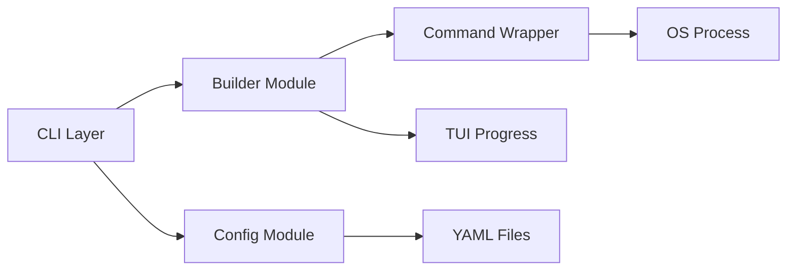

# Requirements

### Overview & Goals
The goal is to complete the transition of the `baldr` tool from its original Rust implementation to a more feature-rich C++ version. This includes porting all core builder functionalities (CMake wrapping, debugging, executable discovery) while leaning into the unique "different direction" of the C++ project: a library-first approach (using `libnova`) and a TUI-centric terminal experience.

### Scope
- **Porting**: `configure`, `build`, `run`, `debug`, `clean`, `doc` commands.
- **Config**: YAML-based configuration with hierarchical merging.
- **Global Flags**: Support for a global `--project` flag that applies to all subcommands.
- **UI**: Integration of `baldr::progress` across all commands for a rich TUI.
- **Documentation**: A new multi-file AsciiDoc book structure including User and Developer guides.

### Functional Requirements
- **Feature Parity**: Must support all features of the Rust implementation, including debugger support and config merging.
- **TUI focus**: All build/configure operations must provide real-time TUI feedback.
- **Documentation**: The documentation must be split into logical pieces and unified in a master book.
- **API Direction**: The CLI API should reflect a more integrated, TUI-first tool compared to the Rust original.

# Technical Design

### Current Implementation
The C++ project currently has a basic CLI structure using `boost::program_options` and a TUI progress utility. It has a simple `run` command and an experimental `docker` client.

### Key Decisions
- **Global Flag Support**: Use a two-stage parsing approach in `main.cpp` to separate global options from subcommand-specific ones.
- **TUI-Centricity**: The tool will prioritize clean, non-cluttering output using ANSI sequences via the `progress` class.
- **YAML Config**: YAML will be used for configuration to provide a balance between human readability and structure, leveraging the existing `yaml-cpp` dependency.
- **Process Spawning**: The `baldr::command` class will be refined to act as a robust wrapper for system processes, handling environment variables (like `CC` and `CXX`) and pipe-based I/O.

### Architecture
The tool will follow a modular architecture within the `baldr` namespace:
- `baldr::Config`: Handles YAML parsing and merging.
- `baldr::Builder`: Orchestrates CMake and build operations.
- `baldr::Command`: Manages low-level process lifecycle.
- `baldr::Progress`: Manages the TUI state and rendering.

### File Structure
- `baldr-cpp/baldr/`
    - `config.hpp`/`.cpp`: Configuration logic.
    - `builder.hpp`/`.cpp`: Core build subcommands.
    - `utils.hpp`/`.cpp`: Executable discovery, symlinks, and path helpers.
- `doc/`
    - `book.adoc`: The master book.
    - `user-guide.adoc`: CLI usage and commands.
    - `developer-guide.adoc`: Internal design and task plan.
- `res/`
    - `dark-doc.css`: The documentation theme.

### Architecture Diagram

# Delivery Steps

### ✓ Step 1: Reorganize and Expand Documentation into a Master Book
Restructured documentation into a unified book format.

- Create `doc/book.adoc` as the main entry point for documentation.
- Extract user-facing command documentation and usage into `doc/user-guide.adoc`.
- Create `doc/developer-guide.adoc` covering architecture, build system, and the project task plan.
- Update `tools/doc.sh` to support compiling the new book structure.
- Remove or repurpose the old `doc/baldr.adoc` to avoid redundancy.
- **Done**: Filled in missing command documentation and updated internal architecture details.

### ✓ Step 2: Implement YAML Configuration and Project Configuration Subcommand
Implemented a robust configuration system using YAML.

- Implement a `Config` class using `yaml-cpp` to handle settings like compiler paths and default flags.
- Implement hierarchical configuration loading (XDG config, home directory, and project-local `.baldr.yaml`).
- Add a `configure` subcommand to the C++ CLI to handle CMake project generation with the new config settings.
- Integrate TUI progress reporting into the configuration phase.

### ✓ Step 3: Implement Build, Run, and Debug Subcommands with TUI Focus
Ported core build and execution features from Rust to C++.

- Implement the `build` subcommand, wrapping `cmake --build` with support for targets and parallel jobs.
- Enhance the `run` and `test` subcommands to fully match Rust feature parity, including output polling.
- Implement the `debug` subcommand to spawn `gdb`/`lldb` for project executables.
- Implement utility features like `compile_commands.json` symlink creation and recursive executable discovery.
- Ensure all subcommands use the `baldr::progress` TUI for a consistent and refined terminal experience.

### * Step 4: Implement Global Project Flag in CLI and Configuration Loader
Enable consistent project path management across all subcommands.

- Update `baldr::Config::load()` to accept an optional project path that overrides the default current directory.
- Restructure `main.cpp` to parse global options (like `--project` and `--help`) before dispatching to subcommand-specific parsers.
- Merge global variables into the final command-line context to ensure accessibility across all modules.

###   Step 5: Update User Documentation for Global Options
Reflect the updated CLI structure in the user-facing guides.

- Add a "Global Options" section to `doc/user-guide.adoc` describing the `--project` flag.
- Remove redundant `--project` flag descriptions from individual subcommands to reduce documentation clutter.
- Verify that the master documentation compiles correctly with the new structure.